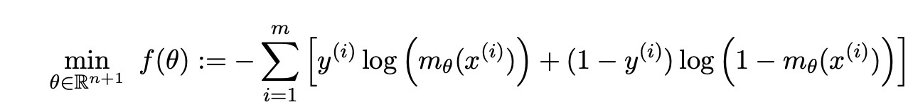

# Breast Cancer Diagnosis – Logistic Regression with First-Order Methods

This project implements and analyzes first-order optimization algorithms for binary classification using logistic regression. The objective is to identify whether a tumor is malignant or benign based on diagnostic features.

The analysis is based on the [Breast Cancer Wisconsin (Diagnostic) dataset](https://archive.ics.uci.edu/dataset/17/breast+cancer+wisconsin+diagnostic), and includes both algorithmic convergence and regularization studies.

## Objective

The goal is to predict whether a tumor is malignant or benign using logistic regression, optimized via gradient descent. The project emphasizes the mathematical foundation and practical implementation of first-order methods, with a focus on convergence behavior and regularization.

## Problem Formulation

The logistic regression problem is cast as an unconstrained optimization task. The loss function is minimized over the training set to find the best decision boundary.

  

## Regularization

To improve generalization and prevent overfitting, L2 regularization was introduced. This modifies the cost function by adding a penalty term proportional to the squared norm of the model parameters. The updated optimization problem is shown below:

  

I did experiments by varying the regularization coefficient λ (lambda) to assess its effect on classification performance. The results are discussed below.

## Methodology

- Binary classification using logistic regression
- Implementation of batch gradient descent with configurable step size
- Comparison of plain vs accelerated (Nesterov) gradient methods
- Exploration of L2 regularization (Ridge penalty)
- Evaluation using misclassification rate and loss convergence

## Results

### Convergence of Gradient vs Accelerated Methods

The figure below shows the convergence of the cost function with the number of iterations. The accelerated gradient method (black) reaches a lower cost significantly faster than standard gradient descent (red).

  

### Effect of Regularization

Regularization helps prevent overfitting by penalizing large model weights. The plot below shows the effect of varying the regularization strength λ on the model's misclassification rate.

  

We observe that small values of λ improve classification accuracy. However, large values can lead to underfitting and degrade model performance.

## Contact

For any questions or collaborations, feel free to reach out:  
📧 alexandre.youssef.pro@gmail.com
